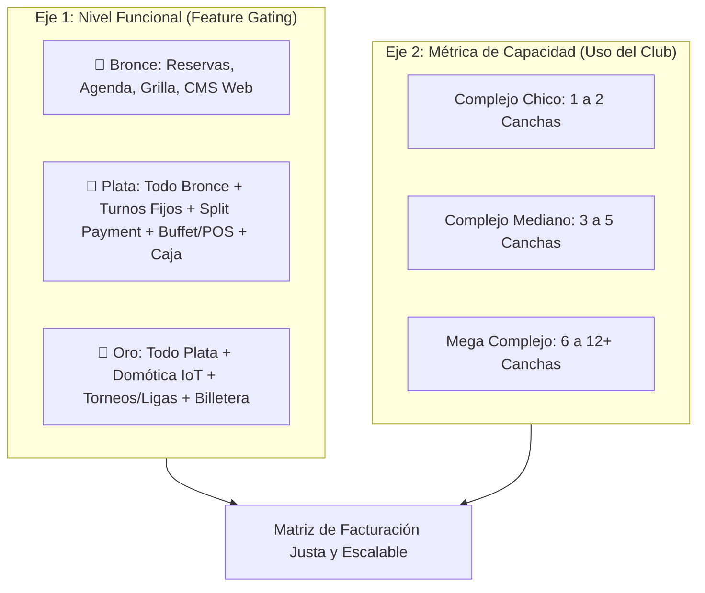
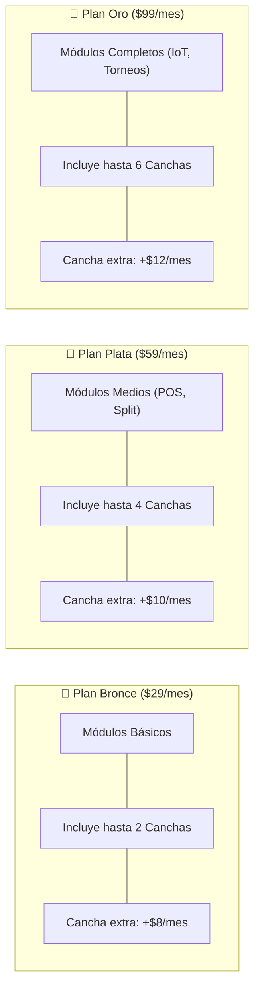

# Esquema de Pricing y Monetización: Módulos vs. Capacidad de Canchas en Turnos.com

> **Documento:** `/docs/esquema_pricing_modulos_y_canchas.md`  
> **Fecha:** Septiembre de 2026  
> **Propósito:** Definir y estructurar la relación entre el **Control por Funcionalidad** (Planes Bronce, Plata y Oro) y la **Métrica de Capacidad** (Cantidad de Canchas) en la plataforma SaaS.

---

## 1. El Concepto: Modelo de Pricing Bidimensional (2D)

En el software B2B moderno no se elige entre cobrar por módulos o cobrar por capacidad; **se combinan ambos ejes** para lograr un esquema justo, comprensible y altamente rentable:

* **Eje Vertical (Módulos / Herramientas):** Determina *qué puede hacer* el club en la plataforma (gestionado en el backend mediante el middleware `tenant.has_module:slug` y `TenantScope`).
* **Eje Horizontal (Cantidad de Canchas):** Determina *el volumen y escala* del negocio que el club opera sobre la plataforma.

---

## 2. Las 3 Alternativas de Implementación

---

### Alternativa 1: Cupo Base de Canchas por Plan + Adicional por Cancha Extra *(Recomendada)*

Cada plan mantiene su conjunto de módulos exclusivos e incluye un cupo de canchas dimensionado para el tipo de club habitual que demanda esas herramientas. Si el club tiene más canchas que las del cupo base, abona un costo marginal accesible por cada cancha extra.

#### ¿Por qué es la más recomendada?
1. **Atractiva para clubes pequeños:** Un club de 2 canchas puede tener el Plan Oro por solo $99/mes sin pagar sobrecostos.
2. **Monetiza los grandes establecimientos:** Un club de 12 canchas con Plan Oro abonará $99 + (6 canchas extra × $12) = **$171/mes**, lo cual representa una fracción mínima de su facturación mensual (que supera los $20.000 USD/mes).
3. **Psicología de compra:** Para el dueño, pagar $10 USD/mes por una cancha extra equivale a alquilar **menos de 1 hora de turno** en todo el mes.

---

### Alternativa 2: Planes como Base Funcional + Multiplicador Marginal por Cancha

El club abona un costo fijo reducido según el paquete de módulos que elija, más un valor fijo por cada cancha que active en el panel:

$$\text{Abono Total} = \text{Base del Plan} + (\text{Cantidad de Canchas} \times \text{Tarifa Cancha})$$

| Plan | Base Fija Mensual | Tarifa por Cancha Administrada |
| :--- | :--- | :--- |
| **Bronce** | $19 USD / mes | + $6 USD / cancha / mes |
| **Plata** | $39 USD / mes | + $8 USD / cancha / mes |
| **Oro** | $69 USD / mes | + $10 USD / cancha / mes |

* **Ejemplo Club 3 canchas (Plata):** $39 + (3 × $8) = **$63 USD/mes**.
* **Ejemplo Club 8 canchas (Oro):** $69 + (8 × $10) = **$149 USD/mes**.

---

### Alternativa 3: Tarifa Plana por Plan con Canchas Ilimitadas *(Esquema Inicial)*

El club paga el precio fijo del plan (Bronce $29, Plata $59, Oro $99) sin importar si administra 1 cancha o 15 canchas.

* **Ventaja:** Máxima simplicidad comercial inicial. No hay que explicar costos adicionales.
* **Riesgo:** Si un complejo de 15 canchas con 2.500 reservas mensuales y alta carga de WhatsApp abona solo $99/mes, los costos de infraestructura y soporte reducen significativamente el margen del SaaS.

---

## 3. Matriz Comparativa Detallada de la Alternativa 1 (Recomendada)

| Parámetro | 🥉 Plan Bronce | 🥈 Plan Plata | 🥇 Plan Oro |
| :--- | :--- | :--- | :--- |
| **Precio Base Mensual** | **$29 USD** | **$59 USD** | **$99 USD** |
| **Cupo de Canchas Incluidas** | **Hasta 2 Canchas** | **Hasta 4 Canchas** | **Hasta 6 Canchas** |
| **Costo por Cancha Excedente** | +$8 USD / cancha / mes | +$10 USD / cancha / mes | +$12 USD / cancha / mes |
| **Módulos Core Incluidos** | • Reservas & Grilla horaria • Subdominio propio • CMS Web personalizable • Asignación en mostrador | • Todo lo de Bronce • Turnos Fijos recurrentes • Partidos abiertos & Split • Punto de Venta (POS / Buffet) • Arqueo de caja diaria | • Todo lo de Plata • Domótica IoT (Luces automáticas) • Gestor de Torneos y Cuadros • Billetera virtual de clientes • Subida S3/R2 presigned |
| **Canal Propio (`[club].turnos.com`)** | **0% Comisión** | **0% Comisión** | **0% Comisión** |
| **Marketplace (`jugar.turnos.com`)** | 5% por turno captado | 4% por turno captado | 3% por turno captado |
| **Límite Recordatorios WhatsApp** | Hasta 300 msgs / mes | Hasta 800 msgs / mes | Hasta 2.000 msgs / mes |
| **Soporte** | Estándar por Ticket | Asistido por Email / Chat | Prioritario 24/7 WhatsApp |

---

## 4. Simulaciones Financieras en Escenarios Reales

### Escenario A: Club de Barrio / Cancha Individual (2 Canchas de Pádel)
* **Facturación mensual estimada del club:** $2.500.000 ARS (~$2.000 USD).
* **Plan elegido:** **Bronce** (necesita solo reservas y mostrador).
* **Cálculo:**
  * Base Bronce (incluye 2 canchas): **$29 USD/mes**.
  * Canchas extras: 0.
  * **Total para el club:** **$29 USD/mes** (1,4% de sus ingresos). Muy accesible, retención garantizada.

---

### Escenario B: Complejo Promedio (4 Canchas: 3 Pádel + 1 Fútbol 5)
* **Facturación mensual estimada del club:** $8.000.000 ARS (~$6.500 USD).
* **Plan elegido:** **Plata** (requiere buffet, turnos fijos semanales y caja).
* **Cálculo:**
  * Base Plata (incluye 4 canchas): **$59 USD/mes**.
  * Canchas extras: 0.
  * **Total para el club:** **$59 USD/mes** (menos del 1% de su facturación).

---

### Escenario C: Club de Tenis / Pádel en Crecimiento (6 Canchas)
* **Facturación mensual estimada del club:** $14.000.000 ARS (~$11.500 USD).
* **Plan elegido:** **Plata** (4 canchas incluidas + 2 canchas excedentes).
* **Cálculo:**
  * Base Plata: $59 USD.
  * 2 canchas excedentes: 2 × $10 = $20 USD.
  * **Total para el club:** **$79 USD/mes**.

---

### Escenario D: Mega Complejo Deportivo (10 Canchas + Bar + Torneos + IoT)
* **Facturación mensual estimada del club:** $30.000.000 ARS (~$25.000 USD).
* **Plan elegido:** **Oro** (domótica de luces, torneos, split payment, POS completo).
* **Cálculo:**
  * Base Oro (incluye 6 canchas): $99 USD.
  * 4 canchas excedentes: 4 × $12 = $48 USD.
  * **Total para el club:** **$147 USD/mes**.
  * **Impacto en el club:** Paga $147 USD por un software que le automatiza $25.000 USD de negocio. Es un precio percibido como baratísimo, y el SaaS captura un ARPU (ingreso promedio por usuario) 5 veces superior al de un club chico.

---

## 5. Justificación Técnica y Costos Operativos de Escala

Cobrar por cancha no es solo una decisión comercial, sino de **sostenibilidad técnica**:

1. **Notificaciones de WhatsApp (Evolution API):**
   * Un club de 2 canchas despacha ~200 recordatorios al mes.
   * Un club de 10 canchas despacha entre 1.500 y 2.500 recordatorios al mes.
2. **Consumo de Domótica IoT:**
   * Cada cancha vinculada a un relé IoT ejecuta consultas de sincronización de estado cada 60 segundos (`iot:sincronizar-luces`). A mayor cantidad de canchas, mayor concurrencia de jobs en cola.
3. **Caché y Base de Datos (PostgreSQL & Redis):**
   * El cálculo de disponibilidad por matriz de slots temporales multiplica su espacio en memoria y tiempo de CPU por cada cancha activa.

---

## 6. Referencias y Benchmarks en la Industria

* **CourtReserve (EE.UU.):** Planes *Starter ($85), Core ($125) y Pro ($165)*. Todos incluyen hasta 4 canchas. Cada cancha extra abona entre $10 y $15 USD/mes.
* **Alquila Tu Cancha (ATC - Argentina/LatAm):** Segmenta sus abonos de software según el tamaño del complejo (1-3 canchas, 4-6 canchas, 7+ canchas) sumado a la comisión transaccional en su marketplace.
* **Shopify (E-commerce):** Planes *Basic ($39), Shopify ($105), Advanced ($399)*. Los planes definen las herramientas avanzadas, pero limitan la cantidad de sucursales e inventarios físicos que se pueden administrar.

---

## 7. Conclusión y Hoja de Ruta para Turnos.com

1. **La lógica de permisos existente permanece 100% intacta:**
   El middleware `tenant.has_module:slug` y los 7 módulos core (`reservas`, `pos_buffet`, `torneos`, `cms_web`, `domotica`, `split_payment`, `turnos_fijos`) siguen controlando estrictamente las pantallas y APIs según el plan asignado en la base de datos.
2. **Validación suave de canchas al dar de alta:**
   Al crear una nueva cancha en `/panel`, el sistema simplemente verifica:
   $$\text{Canchas creadas} \le \text{Canchas permitidas por el plan + extras contratadas}$$
   Si el club intenta dar de alta una 5ª cancha estando en Plata (cupo 4), el sistema le muestra un modal: *"Tu plan incluye 4 canchas. ¿Deseas sumar 1 cancha adicional por $10/mes o subir al Plan Oro?"*.
