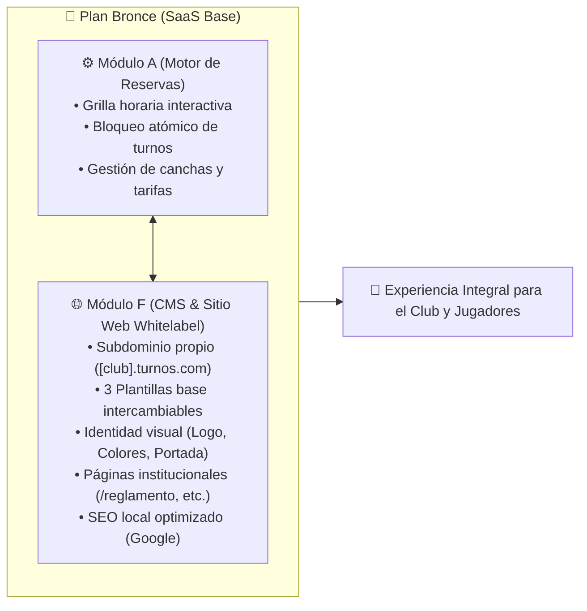
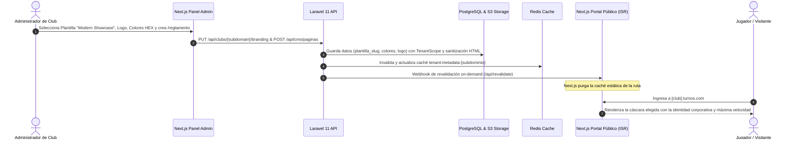

# Macro Plan de Desarrollo: Módulo F - Creador de Sitios Web Dinámicos (CMS Multitenant)

> **Documento:** `/docs/macro_plan_modulo_f_cms.md`  
> **Fecha:** Septiembre de 2026  
> **Plan Asociado:** **Plan Bronce (Operativo Esencial)**  
> **Estado:** Propuesta Oficial con Soporte de 3 Plantillas Base  
> **Referencia Arquitectónica:** [`docs/plan_de_trabajo V4.md`](file:///home/usuario/aplicaciones/turnos/docs/plan_de_trabajo%20V4.md) y [`docs/esquema_pricing_modulos_y_canchas.md`](file:///home/usuario/aplicaciones/turnos/docs/esquema_pricing_modulos_y_canchas.md)

---

## 1. Visión y Propósito del Módulo F

El **Módulo F (CMS Multitenant)** es la pieza que completa la propuesta de valor comercial del **Plan Bronce** (el plan más básico y accesible de la plataforma). Mientras que el **Módulo A** resuelve la operativa interna (agenda, grilla de turnos y motor de disponibilidad), el **Módulo F** resuelve la presencia digital del club hacia sus clientes ("estilo Tiendanube deportivo"):



Con este módulo, cada club obtiene una **página web institucional independiente, rápida y con su propia identidad de marca**, sin necesidad de contratar programadores externos ni pagar hosting adicional.

---

## 2. Alcance Funcional a Grandes Rasgos

El módulo se compone de **5 ejes funcionales principales**:

1. **Selector de Plantillas Base (Cáscaras de Diseño Web Intercambiables):**
   El administrador del club puede elegir entre al menos **3 plantillas prediseñadas** que estructuran la disposición y narrativa visual de su sitio público:
   * **Plantilla A: "Booking Direct / Operativa" (Estilo App Rápida):** Enfoque 100% en la reserva ágil. Cabecera compacta y la grilla de disponibilidad en primer plano superior sin distracciones. Ideal para complejos de pádel o fútbol orientados a jugadores frecuentes que buscan disponibilidad inmediata.
   * **Plantilla B: "Club Tradicional / Institucional" (Estilo Club Social o Polideportivo):** Gran banner de portada (Hero cover), mensaje de bienvenida del club, bloques informativos de servicios e instalaciones destacadas, menú superior hacia páginas institucionales (`/quienes-somos`, `/reglamento`, `/tarifas`), y grilla de reservas integrada como sección central.
   * **Plantilla C: "Modern Showcase / Premium" (Estilo Complejo Boutique):** Estética contemporánea de alto impacto visual con diseño adaptado a contrastes modernos, tarjetas fotográficas amplias por cada cancha con insignias de equipamiento (césped sintético pro, LED, climatizada, cámaras), barra de contacto flotante y reserva interactiva.

2. **Identidad Visual y Personalización de Marca (Branding Whitelabel):**
   * Carga de logotipo oficial y banner de portada (Hero cover).
   * Definición de paleta de colores institucionales (Color primario, secundario, contraste).
   * Enlaces directos a redes sociales (Instagram, Facebook, TikTok, WhatsApp).
   * Eslogan y reseña institucional ("Sobre nosotros").

3. **Constructor y Gestor de Páginas Ilimitadas (CMS Institucional):**
   * Panel de administración para crear, editar, ordenar y despublicar páginas personalizadas (ej. `/reglamento`, `/tarifas`, `/quienes-somos`, `/cumpleanos-eventos`).
   * Editor de texto enriquecido (WYSIWYG seguro) con soporte de títulos, listas, párrafos y formatos limpios.
   * Sanitización estricta contra inyecciones de código malicioso (anti-XSS).

4. **Navegación y Portal Público del Club (Frontend Whitelabel en Next.js):**
   * Barra de navegación (Header) y Pie de página (Footer) dinámicos que adoptan la plantilla elegida, paleta de colores y enlaces del club.
   * Integración fluida entre las páginas informativas y el motor de reservas de la página principal.
   * Diseño 100% responsivo optimizado para teléfonos móviles.

5. **SEO Local y Posicionamiento Orgánico en Google:**
   * Generación de metadatos automáticos por página (Open Graph, Twitter Cards).
   * Inyección de microdatos estructurados Schema.org (`SportsClub` / `LocalBusiness`) con coordenadas GPS, dirección, teléfono y horarios para destacar en Google Maps y búsquedas locales.
   * Rendimiento ultrarrápido mediante Regeneración Estática Incremental (ISR) en Next.js y revalidación bajo demanda ante cambios.

---

## 3. Arquitectura Técnica y Flujo de Información



---

## 4. Estructura del Macro Plan por Etapas

El desarrollo se divide en **5 etapas ordenadas secuencialmente**, pensadas para seguir la *Regla de Oro* (Estructura $\rightarrow$ Lógica $\rightarrow$ Frontend $\rightarrow$ Pruebas):

```
┌────────────────────────────────────────────────────────────────────────┐
│  ETAPA 1: Modelo de Datos, Branding & Almacenamiento (Backend Core)    │
│  - Campos de plantilla_slug, paleta HEX, logo, portada y páginas       │
└──────────────────────────────────┬─────────────────────────────────────┘
                                   │
┌──────────────────────────────────▼─────────────────────────────────────┐
│  ETAPA 2: Panel de Admin - Selector de Plantillas & Identidad Visual   │
│  - Selector visual de las 3 plantillas, color picker y uploaders       │
└──────────────────────────────────┬─────────────────────────────────────┘
                                   │
┌──────────────────────────────────▼─────────────────────────────────────┐
│  ETAPA 3: Gestor y Editor de Páginas Institucionales (Panel CMS)       │
│  - CRUD de páginas, editor enriquecido WYSIWYG y anti-XSS             │
└──────────────────────────────────┬─────────────────────────────────────┘
                                   │
┌──────────────────────────────────▼─────────────────────────────────────┐
│  ETAPA 4: Implementación de las 3 Plantillas Públicas en Next.js       │
│  - Layouts modulares (Booking, Institucional, Showcase) + Theme Tokens │
└──────────────────────────────────┬─────────────────────────────────────┘
                                   │
┌──────────────────────────────────▼─────────────────────────────────────┐
│  ETAPA 5: SEO Local, Schema JSON-LD, Caché ISR & Automatización        │
│  - Metadatos SSR, Schema.org SportsClub, webhook de purga de caché     │
└────────────────────────────────────────────────────────────────────────┘
```

---

### Etapa 1: Modelo de Datos, Branding & Almacenamiento (Backend Core)
* **Objetivo:** Preparar la base de datos y la API de Laravel para almacenar y servir la información visual, la selección de plantilla y las páginas del club.
* **Componentes principales:**
  1. *Migración de Branding y Plantilla:* Ampliar la tabla `complejos` con columnas para:
     * `plantilla_slug` (`booking_direct`, `institucional`, `modern_showcase`, default: `booking_direct`).
     * `logo_url`, `portada_url`.
     * `color_primario`, `color_secundario`, `color_acento`, `color_fondo`.
     * `eslogan`, `descripcion_corta`.
     * `redes_sociales` (JSON o columnas individuales `instagram_url`, `facebook_url`, `tiktok_url`, `youtube_url`).
  2. *Migración de Páginas:* Enriquecer la tabla `paginas` existente con campos para orden de visualización (`orden`), visibilidad en cabecera/pie (`mostrar_en_header`, `mostrar_en_footer`) y descripción SEO (`meta_descripcion`).
  3. *Endpoints de Branding:* Rutas protegidas para consultar y actualizar la identidad corporativa y la plantilla seleccionada (`PUT /api/clubs/{subdomain}/branding`), con subida de imágenes (logo/portada) vía almacenamiento local/S3.
  4. *Caché en Redis:* Cacheo automático de los metadatos visuales del inquilino (`tenant:metadata:{subdominio}`) con invalidación ante actualizaciones.

---

### Etapa 2: Panel de Administración - Selector de Plantillas & Identidad Visual (Frontend Admin)
* **Objetivo:** Proveer al administrador del club una interfaz intuitiva dentro de `/panel` para configurar la estética y layout de su sitio.
* **Componentes principales:**
  1. *Nueva Sección / Pestaña en el Panel:* Pestaña dedicada **"Sitio Web & Marca"** en el panel del club.
  2. *Selector Visual de las 3 Plantillas:* Tarjetas interactivas con miniaturas ilustrativas de cada plantilla (*Booking Direct*, *Institucional*, *Modern Showcase*), resumen de fortalezas de cada una y botón para activarla con 1 clic.
  3. *Selector de Colores con Preview:* Controles de selección de colores institucionales (Color picker con paletas preconfiguradas y HEX manual) con previsualizador en vivo de contraste y legibilidad.
  4. *Carga de Logotipo y Banner Hero:* Componente de subida y previsualización de imágenes optimizadas para la cabecera del club.
  5. *Gestión de Enlaces Sociales y Eslogan:* Campos para Instagram, Facebook, TikTok, canal de WhatsApp y reseña de presentación.

---

### Etapa 3: Gestor y Editor de Páginas Institucionales (Panel CMS)
* **Objetivo:** Permitir al club redactar y publicar contenidos institucionales (reglamentos, tarifas especiales, historia, servicios) de manera autónoma.
* **Componentes principales:**
  1. *Listado de Páginas del Club:* Tabla con acciones de editar, previsualizar, alternar estado (Borrador / Publicada) y eliminar.
  2. *Editor de Contenido Enriquecido:* Editor amigable (tipo TipTap o editor con barra de herramientas de formato) para dar estilo al texto sin requerir conocimientos de código.
  3. *Ajustes de Publicación y Menú:* Checkboxes para definir si la página se vincula automáticamente en el menú superior o en el pie de página.
  4. *Seguridad:* Sanitización estricta en servidor y cliente para asegurar que el contenido HTML no contenga scripts maliciosos.

---

### Etapa 4: Implementación de las 3 Plantillas Públicas en Next.js
* **Objetivo:** Hacer que la página web pública del club (`[subdomain].turnos.com` o `localhost:8080`) renderice la cáscara seleccionada y refleje fielmente la identidad configurada.
* **Componentes principales:**
  1. *Arquitectura de Layouts Modulares:* Next.js renderiza el layout correspondiente según `complejo.plantilla_slug`:
     * **Layout A (Booking Direct):** Cabecera minimalista con logo y contacto, grilla de canchas y turnos en la parte superior, sin bloques informativos intermedios.
     * **Layout B (Institucional Clásico):** Hero banner imponente con foto de portada y eslogan, menú desplegable con páginas institucionales, bloque de servicios destacados y grilla integrada.
     * **Layout C (Modern Showcase):** Tarjetas amplias con fotos y características técnicas de cada cancha, diseño con contraste moderno y llamada a la acción flotante para reservar.
  2. *Inyección Dinámica de Tokens de Color:* Variables CSS aplicadas dinámicamente según la paleta del club (botones de acción, insignias, bordes activos y acentos).
  3. *Header y Footer Compartidos pero Adaptables:* Cabecera y pie de página institucionales con menú dinámico a las páginas creadas (`/quienes-somos`, `/reglamento`) y enlaces a redes sociales.
  4. *Página de Detalle de Contenido (`/paginas/[slug]`):* Vista pública optimizada para lectura que respeta la plantilla y paleta del club, con botón de retorno a reservas.

---

### Etapa 5: SEO Local, Schema JSON-LD, Caché ISR & Automatización
* **Objetivo:** Garantizar que el sitio web de cada club cargue de inmediato y posicione en los primeros lugares de Google para búsquedas de su ciudad o deporte.
* **Componentes principales:**
  1. *Metadatos Dinámicos (SSR):* Generación de títulos y descripciones Open Graph específicas para WhatsApp, Facebook y Twitter con la imagen del club.
  2. *Microdatos Schema.org (`SportsClub`):* Script JSON-LD estructurado con dirección exacta, coordenadas GPS, deportes disponibles y horarios para indexación en Google Maps.
  3. *Revalidación On-Demand (ISR):* Webhook automático que regenera la caché estática de Next.js inmediatamente después de que el club guarda cambios en su panel.
  4. *Sitemap Dinámico:* Generación de `/sitemap.xml` para indexación de todas las páginas activas del complejo.

---

## 5. Criterios de Aceptación y Pruebas del Módulo

Para dar por concluido el Módulo F, se deberán cumplir los siguientes criterios verificables:

* [ ] **Alternancia de Plantillas:** El administrador puede cambiar entre las 3 plantillas desde su panel y el portal público adopta la nueva estructura de inmediato respetando el logo y los colores corporativos.
* [ ] **Aislamiento Multi-inquilino:** Un club no puede ver, editar ni eliminar las páginas, el branding ni la plantilla de otro club (`TenantScope` y tests de autorización 403).
* [ ] **Seguridad XSS:** Intentos de inyección de etiquetas `<script>` o atributos `onerror` en el editor son neutralizados tanto en backend como en frontend.
* [ ] **Previsualización en Vivo:** Los cambios de colores, plantilla y logotipo se reflejan inmediatamente en el portal público tras guardar.
* [ ] **Velocidad y Caché:** Las páginas públicas cargan en menos de 500 ms gracias a ISR y la revalidación on-demand funciona sin errores.
* [ ] **Validación de Tests Automatizados:** Todos los tests de backend (`php artisan test`) y de frontend (`npm test`) deben correr al 100% en verde antes de cada commit.

---

## 6. Próximo Paso Recomendado

Una vez aprobado este marco general:
1. Iniciar con la **Etapa 1** (Estructura de Base de Datos y Endpoints de Branding y Plantillas en Laravel).
2. Desarrollar cada etapa mediante tareas atómicas y commits individuales verificados con tests.
