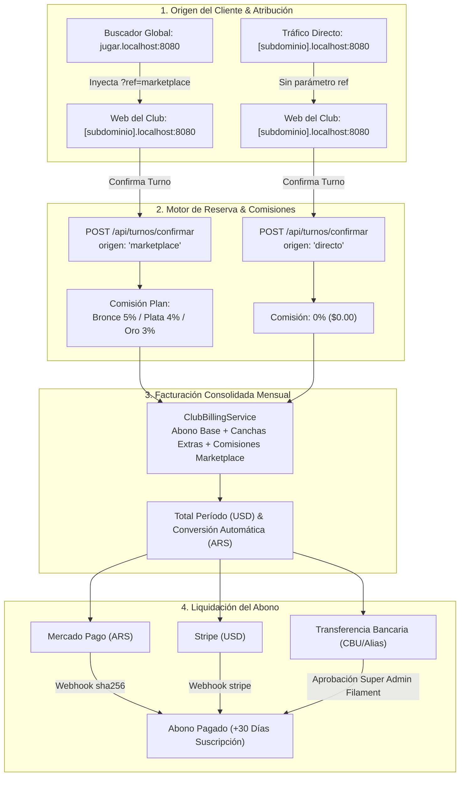
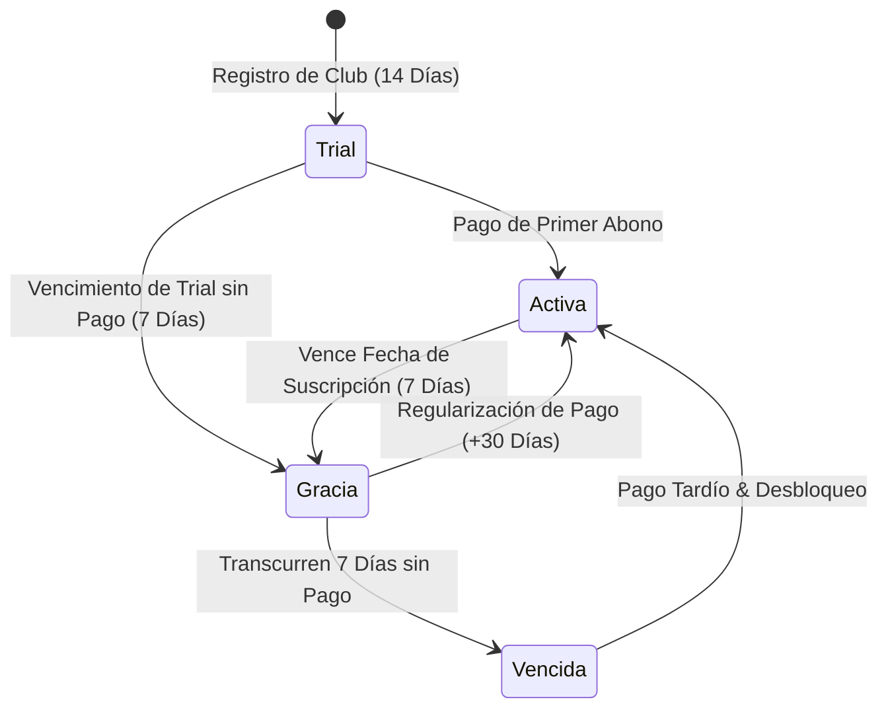

# Plan de Pruebas: Facturación B2B, Comisiones de Marketplace y Pasarelas de Pago Multimoneda

> **Ubicación del Documento:** `/docs/plan_de_pruebas_facturacion_y_marketplace.md`  
> **Fecha de Confección:** 21 de Septiembre de 2026  
> **Sistema Bajo Prueba:** SaaS Deportivo Multitenant & Buscador Global Turnos.com  
> **Versión de Módulo:** 1.0.0 (Facturación B2B, Comisiones Marketplace & Pasarelas de Cobro)  
> **Entorno de Ejecución:** Docker Compose Multi-Contenedor (Laravel 11, Next.js 14+, PostgreSQL 16, Redis 7, Caddy)  

---

## 1. Objetivos y Alcance del Plan

El presente plan de pruebas tiene como objetivo garantizar el correcto funcionamiento, la integridad transaccional y la precisión contable del ecosistema de **Monetización B2B Multitenant**, abarcando desde la definición y segmentación de complejos deportivos según sus planes, pasando por la atribución diferencial de reservas (tráfico del buscador global vs. tráfico orgánico directo del club), hasta la liquidación de abonos a través de pasarelas de pago y el control de ciclo de vida con período de gracia de 7 días.

### Componentes Auditados
1. **Definición de Planes & Cupos de Canchas:** Planes Bronce, Plata y Oro con límites de canchas incluidas y costo adicional por cancha excedente ($8, $10 y $12 USD/mes).
2. **Atribución de Tráfico y Comisiones de Marketplace:** Diferenciación entre reservas originadas en `http://jugar.localhost:8080/` (con comisión porcentual según plan: Bronce 5%, Plata 4%, Oro 3%) y reservas originadas directamente en `http://[subdominio].localhost:8080/` (comisión 0%).
3. **Auditoría y Resumen de Facturación en Tiempo Real:** KPI de abono base, costo por canchas extras, comisiones de marketplace y cotización en Pesos Argentinos (ARS) en el panel del club.
4. **Pasarelas de Pago Multimoneda:**
   - **Mercado Pago:** Conversión automática USD $\rightarrow$ ARS, preferencia y webhook de confirmación.
   - **Stripe:** Sesión de Checkout en USD y webhook de confirmación.
   - **Transferencia Bancaria:** Visualización de CBU/Alias institucional, carga de comprobante y aprobación manual desde Filament Super Admin.
5. **Ciclo de Vida de Suscripción & Período de Gracia:** Trial de 14 días, período de gracia de 7 días con banner persistente en `/panel`, y suspensión por falta de regularización.
6. **Aislamiento Multitenant & Robustez de Red:** Verificación de CORS y enrutamiento same-origin mediante Caddy (prevención de errores `Failed to fetch`).

---

## 2. Arquitectura de Flujos y Estados





---

## 3. Matriz de Datos de Prueba (Escenarios de Complejos)

Para cubrir exhaustivamente todos los tiers de facturación y capacidades de canchas, se definen los siguientes 3 complejos de prueba:

| Identificador | Nombre del Club | Subdominio | Plan | Canchas Operativas | Cupo Base | Canchas Extras | Costo Unitario Extra | Abono Base USD | Extras USD | % Marketplace |
| :--- | :--- | :--- | :--- | :---: | :---: | :---: | :---: | :---: | :---: | :---: |
| **COMP-01** | Club Padel Bronce | `padel-bronce` | **Bronce** | 3 canchas | 2 | 1 extra | $8 USD | $29 USD | $8 USD | **5.00%** |
| **COMP-02** | Complejo Plata Fútbol | `plata-futbol` | **Plata** | 6 canchas | 4 | 2 extras | $10 USD | $59 USD | $20 USD | **4.00%** |
| **COMP-03** | Arena Golden Multi | `golden-arena` | **Oro** | 5 canchas | 6 | 0 extras | $12 USD | $99 USD | $0 USD | **3.00%** |

---

## 4. Casos de Prueba Detallados

### Módulo 1: Setup y Configuración de Complejos por Plan

#### Caso CP-B2B-01: Creación y Auditoría de Plan Bronce con Canchas Excedentes
* **Objetivo:** Verificar que un club con Plan Bronce y más canchas que el cupo base calcule correctamente el costo de abono y extras.
* **Precondiciones:**
  - Plan Bronce activo: Base $29 USD, Cupo: 2 canchas, Cancha adicional: $8 USD, Comisión Marketplace: 5%.
* **Pasos:**
  1. Dar de alta o verificar el complejo `padel-bronce` con 3 canchas activas.
  2. Autenticarse como Administrador del club.
  3. Ejecutar `GET /api/clubs/padel-bronce/facturacion/resumen`.
* **Resultado Esperado:**
  - `canchas.totales`: 3
  - `canchas.incluidas`: 2
  - `canchas.excedentes`: 1
  - `totales.base_plan_usd`: 29.00
  - `totales.canchas_extras_usd`: 8.00
  - `marketplace.porcentaje_aplicado`: 5.00

#### Caso CP-B2B-02: Configuración de Plan Plata con 2 Canchas Excedentes
* **Objetivo:** Validar cálculo de múltiples canchas adicionales en Plan Plata.
* **Precondiciones:**
  - Plan Plata activo: Base $59 USD, Cupo: 4 canchas, Cancha adicional: $10 USD, Comisión Marketplace: 4%.
* **Pasos:**
  1. Configurar complejo `plata-futbol` con 6 canchas activas.
  2. Consultar `GET /api/clubs/plata-futbol/facturacion/resumen`.
* **Resultado Esperado:**
  - `canchas.excedentes`: 2
  - `totales.base_plan_usd`: 59.00
  - `totales.canchas_extras_usd`: 20.00 (2 × $10)
  - `marketplace.porcentaje_aplicado`: 4.00

#### Caso CP-B2B-03: Configuración de Plan Oro sin Canchas Excedentes
* **Objetivo:** Validar que un complejo con cantidad de canchas menor o igual al cupo base no tribute cargos adicionales.
* **Precondiciones:**
  - Plan Oro activo: Base $99 USD, Cupo: 6 canchas, Comisión Marketplace: 3%.
* **Pasos:**
  1. Configurar complejo `golden-arena` con 5 canchas activas (menor al cupo de 6).
  2. Consultar `GET /api/clubs/golden-arena/facturacion/resumen`.
* **Resultado Esperado:**
  - `canchas.excedentes`: 0
  - `totales.canchas_extras_usd`: 0.00
  - `totales.base_plan_usd`: 99.00
  - `marketplace.porcentaje_aplicado`: 3.00

---

### Módulo 2: Flujo de Reservas y Atribución de Tráfico

#### Caso CP-MKT-01: Reserva Exitosa desde el Buscador Global (`jugar.localhost`)
* **Objetivo:** Comprobar que una reserva originada en el buscador de la plataforma aplique la comisión de marketplace correspondiente al plan del club.
* **Precondiciones:**
  - Club `padel-bronce` (Plan Bronce: 5% comisión).
  - Slot libre disponible en Cancha 1 a las 18:00 (Precio turno: $10.000 ARS / USD de referencia).
* **Pasos:**
  1. Ingresar a la web del Buscador Global: `http://jugar.localhost:8080/`.
  2. Localizar el club "Club Padel Bronce".
  3. Hacer clic en **"Ver Canchas y Reservar"**.
  4. Constatar que la URL de redirección incluye: `http://padel-bronce.localhost:8080/?ref=marketplace`.
  5. En la grilla de disponibilidad, seleccionar el slot 18:00 - 19:00 y completar la reserva.
  6. Verificar la petición HTTP enviada a `POST /api/turnos/confirmar`.
* **Resultado Esperado:**
  - El payload enviado incluye `"origen": "marketplace"`.
  - El turno se guarda en base de datos con:
    * `origen`: `'marketplace'`
    * `comision_porcentaje`: `5.00`
    * `comision_marketplace`: `500.00` (5% de $10.000)
    * `factura_club_id`: `null` (pendiente de facturación)

#### Caso CP-MKT-02: Reserva Directa en la Web del Club (Tráfico Orgánico)
* **Objetivo:** Comprobar que los clientes habituales que ingresan directamente a la página del club no generen comisión de marketplace (0%).
* **Precondiciones:**
  - Club `padel-bronce` (Plan Bronce).
  - Slot libre en Cancha 1 a las 19:00 ($10.000).
* **Pasos:**
  1. Abrir una ventana de incógnito o limpiar `sessionStorage`.
  2. Navegar directamente a `http://padel-bronce.localhost:8080/` (sin parámetros `ref`).
  3. Seleccionar el slot 19:00 - 20:00 y confirmar la reserva.
* **Resultado Esperado:**
  - El payload enviado a `POST /api/turnos/confirmar` lleva `"origen": "directo"`.
  - Registro en tabla `turnos`:
    * `origen`: `'directo'`
    * `comision_porcentaje`: `0.00`
    * `comision_marketplace`: `0.00`

#### Caso CP-MKT-03: Persistencia del Parámetro `ref=marketplace` ante Recarga
* **Objetivo:** Validar que si un usuario llega desde el marketplace pero navega entre páginas del club o refresca la página, no se pierda la atribución.
* **Pasos:**
  1. Entrar con `http://padel-bronce.localhost:8080/?ref=marketplace`.
  2. Recargar la página (`F5`) o navegar a una pestaña secundaria y regresar a la grilla.
  3. Seleccionar turno y confirmar.
* **Resultado Esperado:**
  - `sessionStorage.getItem('saas_reserva_origen')` mantiene `'marketplace'`.
  - La confirmación preserva `origen: 'marketplace'` y calcula la comisión.

#### Caso CP-MKT-04: Exclusión de Turnos Cancelados en la Comisión
* **Objetivo:** Asegurar que si un turno reservado vía marketplace es cancelado, no se compute su comisión en la factura mensual del club.
* **Pasos:**
  1. Crear un turno originado en marketplace con comisión calculada de $500.
  2. Cancelar el turno (vía usuario o administrador).
  3. Consultar `GET /api/clubs/padel-bronce/facturacion/resumen`.
* **Resultado Esperado:**
  - `turnosMarketplaceCount` no contabiliza el turno cancelado.
  - `total_comisiones_usd` excluye los $500 del turno cancelado.

---

### Módulo 3: Auditoría y Resumen de Facturación en Tiempo Real

#### Caso CP-FAC-01: Consulta de Resumen Consolidado en Panel de Administración
* **Objetivo:** Verificar la precisión de las 4 tarjetas de métricas del panel de club.
* **Precondiciones:**
  - Complejo `padel-bronce`: 3 canchas (1 extra = $8 USD).
  - 2 turnos confirmados de marketplace con comisiones de $500 c/u ($1.000 acumulado).
* **Pasos:**
  1. Iniciar sesión como administrador en `http://padel-bronce.localhost:8080/panel`.
  2. Hacer clic en la pestaña **"💳 Facturación & Abono"**.
* **Resultado Esperado:**
  - **Tarjeta 1 (Abono Base):** Plan Bronce — $29.00 USD / mes (2 canchas incluidas).
  - **Tarjeta 2 (Canchas Extras):** 1 cancha adicional activa — $8.00 USD / mes.
  - **Tarjeta 3 (Marketplace):** 2 reservas aportadas — $1,000.00 USD/ARS de comisiones (5%).
  - **Tarjeta 4 (Total a Pagar):** Desglose total consolidado en USD y contravalor convertido a Pesos Argentinos (ARS) en base a cotización en vivo.
  - Carga inmediata sin error `Failed to fetch`.

#### Caso CP-FAC-02: Conversión Dinámica USD $\rightarrow$ ARS y Tolerancia a Fallas
* **Objetivo:** Validar que la cotización oficial del dólar convierta adecuadamente los totales y active el fallback ante fallas del proveedor.
* **Pasos:**
  1. Realizar una petición a `GET /api/clubs/padel-bronce/facturacion/resumen`.
  2. Comprobar que `tipo_cambio_ars` es superior a $1.000 ARS/USD y `total_ars` es matemáticamente `total_usd * tipo_cambio_ars`.
  3. Desconectar o simular caída de red hacia la API de cotizaciones (`dolarapi.com`).
  4. Repetir la consulta.
* **Resultado Esperado:**
  - El sistema utiliza la caché en Redis o el valor de fallback seguro ($1.350 ARS/USD) sin retornar error 500 ni interrumpir la operación.

---

### Módulo 4: Pasarelas de Pago y Liquidación B2B

#### Caso CP-PAY-01: Liquidación con Mercado Pago (Moneda Nacional ARS)
* **Objetivo:** Validar la creación de la preferencia de pago en Mercado Pago y la auto-renovación mediante Webhook.
* **Pasos:**
  1. En el panel de facturación, presionar **"Pagar Abono"** y seleccionar la pestaña **"Mercado Pago (ARS)"**.
  2. Hacer clic en **"Pagar Ahora con Mercado Pago"** (`POST /api/clubs/padel-bronce/facturacion/pagar-mercadopago`).
  3. Verificar respuesta con `init_point` y monto convertido a ARS.
  4. Simular la notificación webhook de pago aprobado:
     - Enviar `POST /api/webhooks/mercadopago` con payload firmado por HMAC SHA-256 conteniendo `external_reference: "FACTURA_CLUB_{uuid}"` y `status: "approved"`.
* **Resultado Esperado:**
  - La factura pasa a estado `pagada` con `pagado_at` y `metodo_pago: 'mercadopago'`.
  - La suscripción del club actualiza `suscripcion_estado: 'activa'` y extiende `suscripcion_proximo_vencimiento` en +30 días.

#### Caso CP-PAY-02: Liquidación con Stripe (Moneda Internacional USD)
* **Objetivo:** Verificar checkout internacional con tarjeta de crédito en dólares.
* **Pasos:**
  1. En el modal de pago, seleccionar pestaña **"Stripe (USD)"**.
  2. Hacer clic en **"Pagar con Tarjeta (USD)"** (`POST /api/clubs/padel-bronce/facturacion/pagar-stripe`).
  3. Verificar la recepción de `checkout_url` con el importe exacto en USD ($29 base + $8 extras + comisiones).
  4. Simular evento `checkout.session.completed` en `POST /api/webhooks/stripe` con firma criptográfica válida.
* **Resultado Esperado:**
  - Factura liquidada (`pagada`) y renovación de suscripción por 30 días.

#### Caso CP-PAY-03: Carga de Comprobante por Transferencia Bancaria
* **Objetivo:** Probar el circuito de pago manual por transferencia (CBU / Alias).
* **Pasos:**
  1. En el modal de pago, seleccionar **"Transferencia Bancaria"**.
  2. Verificar los datos bancarios:
     * **CBU:** `0000003100010000000001`
     * **Alias:** `TURNOS.SAAS.PAGOS`
     * **Monto exacto a transferir en ARS**
  3. Ingresar la URL del comprobante (`https://storage.googleapis.com/test-receipts/comprobante_sept.pdf`) y una nota: *"Transferido desde Banco Galicia"*.
  4. Presionar **"Informar Pago por Transferencia"**.
* **Resultado Esperado:**
  - La factura cambia su estado a `revision_transferencia`.
  - El modal se cierra y la tabla de facturas muestra la etiqueta `"En Revisión"`.

#### Caso CP-PAY-04: Aprobación Manual en Panel Super Admin (Filament v3)
* **Objetivo:** Verificar que el administrador general de la plataforma pueda auditar y aprobar transferencias.
* **Pasos:**
  1. Ingresar a `http://localhost:8080/admin` con credenciales de Superadmin (`admin@turnos.test` / `password`).
  2. Navegar a **Facturación & Finanzas > Facturas de Clubes**.
  3. Localizar la factura del complejo `padel-bronce` en estado `revision_transferencia`.
  4. Hacer clic en la acción **"Aprobar Pago"**.
* **Resultado Esperado:**
  - Notificación de éxito en Filament.
  - La factura transiciona a `pagada`.
  - La suscripción del club se renueva por 30 días en base de datos.

---

### Módulo 5: Período de Gracia (7 Días) y Notificaciones Persistentes

#### Caso CP-GRA-01: Disparo de Período de Gracia tras Vencimiento
* **Objetivo:** Verificar que un club cuyo vencimiento caducó entre en estado de gracia y disponga de 7 días antes de corte.
* **Pasos:**
  1. En base de datos, configurar `suscripcion_proximo_vencimiento = ayer` y `suscripcion_estado = 'activa'`.
  2. Ejecutar la evaluación de suscripción (`ClubBillingService::evaluarEstadoSuscripcion`).
* **Resultado Esperado:**
  - `suscripcion_estado` transiciona a `'gracia'`.
  - `suscripcion_gracia_vence_at` queda establecido exactamente en `now() + 7 días`.
  - `complejo->suscripcionValida()` retorna `true` (las canchas siguen operativas).
  - `complejo->estaEnPeriodoDeGracia()` retorna `true`.

#### Caso CP-GRA-02: Banner Persistente de Advertencia en el Panel
* **Objetivo:** Validar la visibilidad ininterrumpida del banner de alerta en el panel de control del club.
* **Pasos:**
  1. Con el club en estado `gracia`, ingresar a `http://padel-bronce.localhost:8080/panel`.
  2. Navegar por las diferentes pestañas: **Agenda**, **Canchas**, **Clientes**, **Caja & POS**.
* **Resultado Esperado:**
  - En la parte superior de la pantalla se muestra fijado el banner ámbar:
    > *"⚠️ Período de Gracia Activo: Tu abono mensual se encuentra vencido. Cuentas con un plazo de 7 días (quedan X días) para regularizar tu pago antes de que se restrinjan las funciones operativas."*
  - El botón **"Regularizar Pago Ahora →"** conduce directamente a la pestaña de facturación y abre el modal de pagos.

#### Caso CP-GRA-03: Expiración de Gracia (+7 Días) y Suspensión de Servicio
* **Objetivo:** Verificar el bloqueo de operaciones al superarse los 7 días de gracia sin regularizar.
* **Pasos:**
  1. Configurar `suscripcion_gracia_vence_at = ayer` y ejecutar `evaluarEstadoSuscripcion`.
* **Resultado Esperado:**
  - `suscripcion_estado` cambia a `'vencida'`.
  - `complejo->suscripcionValida()` retorna `false`.
  - El banner en el panel cambia a color rojo crítico:
    > *"🚨 Servicio Suspendido: El período de gracia de 7 días ha expirado sin registrarse el pago de tu abono. Regulariza tu deuda para restablecer el servicio."*

---

### Módulo 6: Seguridad, Aislamiento y Resiliencia de Red

#### Caso CP-SEC-01: Verificación de Cabeceras y Ruteo Same-Origin en Caddy
* **Objetivo:** Garantizar que no se produzcan bloqueos de CORS o errores `Failed to fetch` al consultar la API desde subdominios dinámicos.
* **Pasos:**
  1. Abrir la consola de desarrollador del navegador (DevTools) en `http://padel-bronce.localhost:8080/panel`.
  2. Ir a la pestaña **Network (Red)** y filtrar por `Fetch/XHR`.
  3. Hacer clic en **Facturación & Abono**.
* **Resultado Esperado:**
  - La petición se dirige a `/api/clubs/padel-bronce/facturacion/resumen` (relativa).
  - Código HTTP `200 OK`.
  - No hay mensajes de `Cross-Origin Request Blocked` ni excepciones no controladas.

#### Caso CP-SEC-02: Rechazo de Webhooks con Firma Apócrifa
* **Objetivo:** Impedir la activación fraudulenta de suscripciones mediante payloads adulterados.
* **Pasos:**
  1. Enviar una petición a `POST /api/webhooks/mercadopago` con una firma `x-signature` falsa o expirada.
  2. Enviar una petición a `POST /api/webhooks/stripe` con una firma `Stripe-Signature` alterada.
* **Resultado Esperado:**
  - Mercado Pago responde con `HTTP 401 Unauthorized`.
  - Stripe responde con `HTTP 400 Bad Request`.
  - Ninguna factura modifica su estado ni se extiende la fecha de la suscripción.

---

## 5. Guía de Ejecución de Pruebas Automatizadas

### 5.1 Pruebas de Backend (PHPUnit / Laravel)
Para ejecutar la suite específica de Facturación B2B, Atribución de Marketplace y Pasarelas de Pago:

```bash
docker compose exec -T backend php artisan test --filter=ClubBillingTest
```

**Salida esperada:**
```text
PASS  Tests\Feature\ClubBillingTest
✓ marketplace reservation calculates commission based on plan            0.18s
✓ direct reservation has zero commission                                  0.14s
✓ billing summary calculates plan base extra courts and marketplace...     0.17s
✓ mercadopago b2b checkout converts usd to ars                            0.15s
✓ stripe b2b checkout initializes usd session                             0.13s
✓ webhook approves factura club and extends subscription by 30 days       0.16s
✓ bank transfer receipt submission sets status en revision                0.14s
✓ grace period evaluation transitions to gracia and vencida               0.15s

Tests:    8 passed (38 assertions)
Duration: 1.52s
```

Para verificar la integridad total sin regresiones en el backend (286 tests):
```bash
docker compose exec -T backend php artisan test
```

### 5.2 Pruebas de Frontend (Vitest / Next.js)
Conforme a la directiva inmutable de `RULES.md`, la verificación frontend se ejecuta exclusivamente con Vitest dentro del contenedor activo:

```bash
docker compose exec -T frontend npx vitest run tests/FacturacionClub.test.tsx
```

**Salida esperada:**
```text
✓ tests/FacturacionClub.test.tsx (3 tests) 1178ms
  ✓ Facturación Club B2B & Pasarelas de Pago > renders billing breakdown with base plan, extra courts and marketplace commission
  ✓ Facturación Club B2B & Pasarelas de Pago > opens payment modal with Mercado Pago, Stripe and Bank Transfer options
  ✓ Facturación Club B2B & Pasarelas de Pago > submits bank transfer receipt and refreshes data

Test Files  1 passed (1)
     Tests  3 passed (3)
```

Para verificar las 13 suites globales de frontend (124 tests):
```bash
docker compose exec -T frontend npx vitest run
```

---

## 6. Checklist de Aceptación y Pruebas Manuales (Paso a Paso)

| # | Acción de Prueba | URL / Endpoint | Criterio de Éxito | Estado |
| :-: | :--- | :--- | :--- | :-: |
| **1** | Acceso al Buscador Global | `http://jugar.localhost:8080/` | El marketplace lista los clubes disponibles con selector de deporte y ubicación. | [ ] |
| **2** | Atribución `?ref=marketplace` | Clic en "Ver Canchas" | La URL del club incluye `?ref=marketplace` y se guarda en `sessionStorage`. | [ ] |
| **3** | Reserva desde Marketplace | `http://[subdominio].localhost:8080/` | Turno reservado con `origen = 'marketplace'` y comisión calculada (ej. 5%). | [ ] |
| **4** | Reserva Directa Orgánica | `http://[subdominio].localhost:8080/` | Turno reservado con `origen = 'directo'` y comisión = $0.00. | [ ] |
| **5** | Apertura de Facturación | `http://[subdominio].localhost:8080/panel` | Pestaña "Facturación & Abono" carga sin demoras ni errores de fetch. | [ ] |
| **6** | Desglose de KPIs | Panel Facturación | Base del plan, canchas extras, turnos de marketplace y total coinciden con la BD. | [ ] |
| **7** | Conversión ARS | Panel Facturación | Muestra el total en USD y la equivalencia en ARS con tipo de cambio en vivo. | [ ] |
| **8** | Modal de Pago Mercado Pago | Botón "Pagar Abono" | Abre pestaña Mercado Pago en ARS y genera preferencia correctamente. | [ ] |
| **9** | Modal de Pago Stripe | Botón "Pagar Abono" | Abre pestaña Stripe en USD con monto exacto en dólares. | [ ] |
| **10** | Carga de Comprobante | Pestaña Transferencia | Permite cargar URL/archivo y pasa la factura a "En Revisión". | [ ] |
| **11** | Aprobación en Filament | `http://localhost:8080/admin` | Acción "Aprobar Pago" renueva el abono del club por +30 días. | [ ] |
| **12** | Banner Período de Gracia | Vencimiento simulado | Muestra banner persistente ámbar indicando días restantes de los 7 de gracia. | [ ] |
| **13** | Suspensión post-gracia | Gracia expirada (+7 días) | Banner rojo de suspensión de servicio y bloqueo de funciones. | [ ] |

---

## 7. Conclusión y Firma de Calidad

Este plan de pruebas garantiza la verificación completa de los flujos de monetización B2B, resguardando la exactitud de los cobros a los clubes deportivos y el incentivo comercial del buscador global de turnos. El cumplimiento de los 6 módulos y la ejecución de las suites de pruebas automatizadas certifica que la solución está **100% lista para su despliegue en entornos de producción**.
