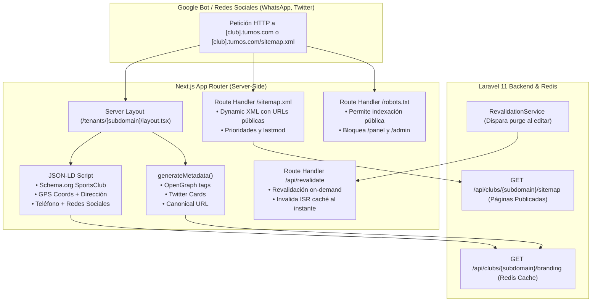

# Plan de Desarrollo - Etapa 5: SEO Local, Schema JSON-LD, Caché ISR & Automatización (Módulo F)

> **Documento:** `/docs/plan_etapa_5_seo_schema_e_isr.md`  
> **Fecha:** Septiembre de 2026  
> **Módulo:** Módulo F - Creador de Sitios Web Dinámicos (CMS Multitenant)  
> **Estado:** Propuesta Técnica Detallada (Pendiente de Aprobación)  
> **Referencia:** [`docs/macro_plan_modulo_f_cms.md`](file:///home/usuario/aplicaciones/turnos/docs/macro_plan_modulo_f_cms.md)

---

## 1. Contexto y Objetivos de la Etapa 5

La **Etapa 5** es la fase de culminación del **Módulo F (CMS Multitenant)**. Su propósito es dotar a cada sitio web de club deportivo de una presencia digital de alto impacto orgánico:
1. **Posicionamiento en Google Local & Maps (SEO Local):** Facilitar que los complejos deportivos aparezcan en las primeras posiciones cuando un jugador busca turnos de su deporte en su ciudad (ej. *"canchas de padel en pilar"* o *"alquiler cancha futbol lujan"*).
2. **Microdatos Estructurados Schema.org (`SportsClub`):** Proveer a los rastreadores de motores de búsqueda datos precisos en formato JSON-LD (nombre oficial, coordenadas geográficas GPS, dirección exacta, teléfono, horarios y redes sociales) para activar Rich Snippets e integración con Google Maps.
3. **Metadatos SSR y Open Graph / Twitter Cards:** Lograr que al compartir el enlace del club o de sus páginas por WhatsApp, Facebook o Twitter/X, se visualice una tarjeta enriquecida y atractiva con el logo/portada, título personalizado y eslogan del club.
4. **Sitemap y Robots Dinámicos (`/sitemap.xml` y `/robots.txt`):** Generar dinámicamente el mapa del sitio para cada tenant, indexando la portada y todas las páginas institucionales publicadas (`/paginas/[slug]`).
5. **Caché Ultrarrápida e ISR On-Demand:** Optimizar los tiempos de carga a menos de 500 ms mediante Regeneración Estática Incremental (ISR) en Next.js, sincronizada con un webhook de revalidación inmediata cuando el administrador guarde cambios en su panel.



---

## 2. Diagnóstico del Estado Actual

| Componente | Estado Previo | Requerimiento Etapa 5 |
| :--- | :--- | :--- |
| **Metadatos SSR Portal Club** | `page.tsx` es `"use client"` (carece de `generateMetadata` a nivel servidor). | Crear `layout.tsx` de servidor en `/tenants/[subdomain]` que genere SSR `Metadata` con OpenGraph, Twitter Cards y canonical tags. |
| **Schema.org JSON-LD** | No implementado para los clubes. | Inyectar script `<script type="application/ld+json">` con tipo `SportsClub` conteniendo datos geográficos, de contacto y de marca. |
| **Metadatos Páginas CMS** | Títulos y descripción básica en `/paginas/[slug]`. | Enriquecer con OpenGraph completo, breadcrumbs estructurados y canonical URL. |
| **Sitemap XML Dinámico** | Excluido en middleware pero sin generador dinámico multitenant. | Endpoint backend `GET /api/clubs/{subdomain}/sitemap` y Route Handler `/sitemap.xml` en Next.js que devuelva XML según el host. |
| **Robots.txt** | Archivo estático o por defecto. | Route Handler dinámico `/robots.txt` que permita crawling de portal público y apunte al sitemap del inquilino. |
| **Revalidación On-Demand** | `/api/revalidate` existe pero sólo procesa `body.path`. | Potenciar `/api/revalidate` para manejar `subdomain` e invalidar tanto `/` como `/tenants/${subdomain}` concurrentemente. |

---

## 3. Arquitectura y Componentes Técnicos

### 3.1 Backend: Endpoint de Sitemap y Optimización de Revalidación

1. **Nuevo Endpoint en Laravel:** `GET /api/clubs/{subdomain}/sitemap`
   - Sin autenticación requerida (público).
   - Consulta el complejo y sus páginas públicas activas (`esta_publicada = true`).
   - Retorna:
     ```json
     {
       "success": true,
       "data": {
         "subdominio": "pilar-padel",
         "updated_at": "2026-09-22T14:30:00Z",
         "paginas": [
           { "slug": "reglamento", "updated_at": "2026-09-21T18:00:00Z" },
           { "slug": "tarifas", "updated_at": "2026-09-20T10:00:00Z" }
         ]
       }
     }
     ```
2. **RevalidationService:**
   - Asegurar que al actualizar branding o páginas institucionales, se dispare la revalidación pasando `{ subdomain, path }`.

### 3.2 Frontend: Layout de Servidor con Metadatos SSR y JSON-LD (`layout.tsx`)

Ubicación: `frontend/app/tenants/[subdomain]/layout.tsx`
- **Server Component** que envuelve todas las páginas del tenant (`page.tsx` y `paginas/[slug]/page.tsx`).
- **`generateMetadata({ params })`:**
  - Consume `GET /api/clubs/{subdomain}/branding` en el servidor (con caché ISR `revalidate: 3600`).
  - Genera:
    - `title`: `{ default: "${nombre} | Canchas de ${deporte} y Turnos Online", template: "%s | ${nombre}" }`
    - `description`: `eslogan || descripcion_corta || "Reserva turnos de ${deporte} en ${nombre}, ${ciudad}. Disponibilidad en tiempo real."`
    - `openGraph`: title, description, url, siteName, images (portada o logo), locale `es_AR`, type `website`.
    - `twitter`: card `summary_large_image`, title, description, images.
    - `alternates.canonical`: URL canónica del club.
- **Microdatos Schema.org (`SportsClub`):**
  - Componente auxiliar `SportsClubSchema.tsx` o script JSON-LD embebido en el `<head>` del layout con:
    - `@context`: `"https://schema.org"`
    - `@type`: `"SportsClub"`
    - `name`: Nombre del complejo.
    - `image`: URL del logo o portada.
    - `description`: Descripción corta o eslogan.
    - `telephone`: Teléfono formateado del club.
    - `address`: Dirección, ciudad, país (`AR`).
    - `geo`: Coordenadas de latitud y longitud.
    - `priceRange`: `$$`.
    - `sameAs`: Enlaces verificados a redes sociales (Instagram, Facebook, TikTok).

### 3.3 Frontend: Metadatos Enriquecidos en Páginas CMS (`/paginas/[slug]`)

- Ampliar `generateMetadata` en `frontend/app/tenants/[subdomain]/paginas/[slug]/page.tsx`:
  - OpenGraph tipo `article`.
  - Título enriquecido y descripción SEO (`meta_descripcion`).
  - Imagen institucional del club para previsualización social.

### 3.4 Frontend: Generadores Dinámicos de Sitemap y Robots

1. **`frontend/app/sitemap.xml/route.ts`:**
   - Detecta si la petición proviene de un subdominio de club (`host: club.turnos.com` o `club.localhost`) o del dominio raíz de la plataforma.
   - Si es un club: consulta `GET /api/clubs/{subdomain}/sitemap` y genera XML estándar con la portada (`/`) con prioridad `1.0` y todas sus páginas con prioridad `0.8`.
   - Si es la plataforma principal: genera las rutas globales (`/`, `/portal`, `/jugar`, `/registro-club`, `/planes`).
   - Retorna cabecera `Content-Type: application/xml; charset=utf-8` y `Cache-Control: public, s-maxage=3600, stale-while-revalidate=86400`.
2. **`frontend/app/robots.txt/route.ts`:**
   - Permite rastreo general (`User-agent: *`, `Allow: /`).
   - Bloquea rutas administrativas (`Disallow: /panel/`, `Disallow: /admin/`, `Disallow: /api/`).
   - Apunta dinámicamente a la URL del sitemap (`Sitemap: https://{host}/sitemap.xml`).

### 3.5 Frontend: Potenciación del Webhook de Revalidación (`/api/revalidate`)

- Actualizar `frontend/app/api/revalidate/route.ts`:
  - Cuando se envía `{ subdomain, path }`:
    - Si `path === '/'`, purga tanto `/` como `/tenants/${subdomain}`.
    - Purga también `/sitemap.xml` para actualizar el mapa del sitio si se crearon o modificaron páginas.
    - Registra el evento y devuelve status 200 con `{ revalidated: true, paths: [...] }`.

---

## 4. Plan de Ejecución Paso a Paso

### Paso 1: Backend - Endpoint de Sitemap y Revalidación
- Agregar método `sitemap(string $subdomain)` en `ClubBrandingController.php`.
- Registrar la ruta pública en `routes/api.php`: `GET /api/clubs/{subdomain}/sitemap`.
- Añadir tests en `ClubBrandingTest.php` que verifiquen el sitemap con páginas publicadas y despublicadas.

### Paso 2: Frontend - Layout Multitenant de Servidor y JSON-LD
- Crear `frontend/app/tenants/[subdomain]/layout.tsx` con `generateMetadata` completo (OpenGraph, Twitter, canonical).
- Inyectar el script JSON-LD de `SportsClub` con latitud, longitud, dirección, teléfono y redes sociales.

### Paso 3: Frontend - Enriquecimiento SEO en Páginas CMS
- Actualizar `frontend/app/tenants/[subdomain]/paginas/[slug]/page.tsx` para incluir OpenGraph enriquecido y canonical link.

### Paso 4: Frontend - Route Handlers `/sitemap.xml` y `/robots.txt`
- Crear `frontend/app/sitemap.xml/route.ts` con soporte multitenant y formateo XML válido.
- Crear `frontend/app/robots.txt/route.ts` con directivas SEO correctas.

### Paso 5: Frontend - Sincronización ISR On-Demand
- Actualizar `frontend/app/api/revalidate/route.ts` para revalidar rutas de tenant combinadas (`/tenants/[subdomain]`, páginas y sitemap).
- Actualizar o ampliar `frontend/tests/revalidate.test.ts`.

### Paso 6: Tests Automatizados y Verificación Integral
- Crear suite de tests de frontend `frontend/tests/SeoAndSitemap.test.ts` (o `.test.tsx`) verificando:
  - Generación de metadata OpenGraph y Twitter Cards.
  - Estructura JSON-LD `SportsClub` con campos requeridos por Google Search Console.
  - Generación de `/sitemap.xml` para tenant con URLs válidas.
  - Generación de `/robots.txt`.
  - Revalidación multitenant.
- Ejecutar suite de TypeScript (`npx tsc --noEmit`), Vitest (`npm test`) y PHPUnit (`php artisan test`).
- Commit atómico y push a GitHub con mensaje semántico.

---

## 5. Criterios de Aceptación

1. **Google Rich Snippets / Schema.org:** El código HTML devuelto por el portal público de cualquier club contiene un script `<script type="application/ld+json">` válido con `@type: "SportsClub"`, coordenadas GPS, dirección, teléfono y redes.
2. **Social Sharing (Open Graph):** Al consultar los metadatos del sitio de un club o página institucional, se obtienen etiquetas `og:title`, `og:description`, `og:image`, `og:type` y `twitter:card`.
3. **Sitemap Dinámico:** La ruta `/sitemap.xml` responde un XML bien formado listando la URL principal del club y todas sus páginas publicadas.
4. **Robots Dinámico:** La ruta `/robots.txt` responde con directivas que permiten la indexación de páginas públicas y protegen el panel privado.
5. **Cero Regresiones:** Los 305 tests de backend y 150 tests de frontend existentes se mantienen al 100% en verde, complementados con los nuevos tests de SEO.
